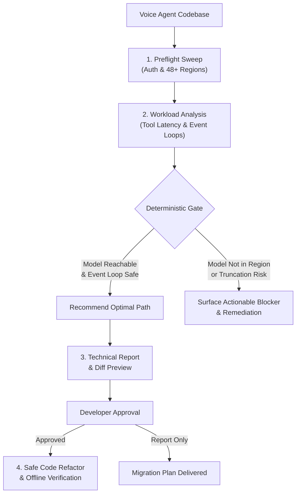
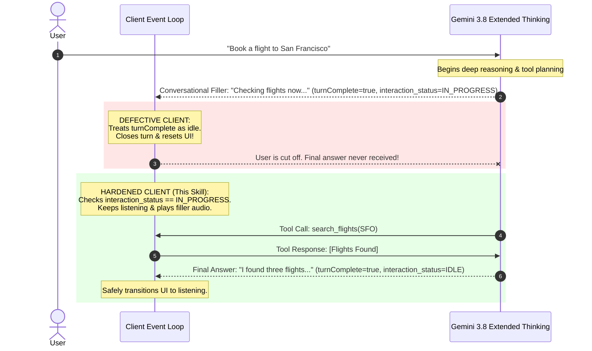

# Gemini 3.8 Live Migration Toolkit

[](https://skills.sh)
[](LICENSE)
[](https://agentskills.io)

Safely migrate your real-time voice agents from `gemini-3.1-flash-live-preview` to `gemini-3.8-live` or `gemini-3.8-live-extended-thinking` without breaking production.

## Why Use This Skill?

Updating a voice agent to Gemini 3.8 is not a simple find-and-replace. Upgrading without analysis can cause silent production failures:

- **Prevents Silent Conversation Truncation**: Extended Thinking emits `turnComplete: true` during conversational fillers ("Let me check that..."). Standard client event loops exit early, cutting off the conversation before the answer arrives.
- **Validates Regional Availability First**: New models roll out across regions gradually. The preflight check sweeps all 48+ Vertex locations to ensure the target model is reachable before touching code.
- **Profiles Tool Latency**: Automatically identifies whether your tools need synchronous (`BLOCKING`) or asynchronous (`NON_BLOCKING`) execution to keep voice turns responsive.
- **Eliminates Hard 400 Errors**: Detects and cleans up removed parameters (`enable_affective_dialog`, `proactive_audio: false`, invalid `thinking_level`) that fail connection handshakes.
- **Zero-Risk Refactoring**: Generates a technical migration report and diff preview for developer review before modifying any files.

---

## Migration Workflow



---

## The `handleTurn` Silent Truncation Trap

The most common defect when migrating to Extended Thinking is premature turn termination. Here is why standard loops fail and how this skill protects your app:



---

## Model Decision Matrix

| Dimension | `gemini-3.8-live` | `gemini-3.8-live-extended-thinking` |
| :--- | :--- | :--- |
| **Primary Use Case** | Low-latency voice assistants, customer triage | Complex reasoning, diagnostics, multi-step problem solving |
| **Voice Turn Latency** | Ultra-fast (<800 ms) | Thoughtful with conversational fillers |
| **Tool Execution** | `BLOCKING` or `NON_BLOCKING` | **`NON_BLOCKING` mandatory** |
| **Event Loop Requirement**| Standard `turnComplete` handling | **Must inspect `interaction_status`** |
| **Migration Risk** | Minimal (drop-in replacement) | Moderate (requires event-loop hardening) |

---

## Installation

### For AI Coding Agents (Claude Code, Cursor, Jetski)

Install directly into your agent environment using `skills.sh`:

```bash
npx skills add adhishthite/migrate-to-gemini-3-8-live
```

Then ask your agent:
> *"Migrate my Live API application to Gemini 3.8."*

---

## Direct CLI Tools

You can also run the bundled analysis and verification tools directly from your terminal:

```bash
# 1. Sweep authentication and regional model reachability
python3 scripts/preflight_check.py .

# 2. Check for silent event loop truncation risks
python3 scripts/analyze_event_loop.py .

# 3. Classify function and tool latency tiers
python3 scripts/classify_tool_latency.py .

# 4. Verify turn handling against multi-stage mock fixtures
python3 scripts/verify_turn.py
```

---

## License

Apache License 2.0. See [LICENSE](LICENSE) for details.
